# Senegal Banques
### Here is a list of all Banques in Senegal.

|               Logo               |                                    Name                                    |                            Location                            |              email               |                                        website                                        |                  phone                   |
|:--------------------------------:|:--------------------------------------------------------------------------:|:--------------------------------------------------------------:|:--------------------------------:|:-------------------------------------------------------------------------------------:|:----------------------------------------:|
|    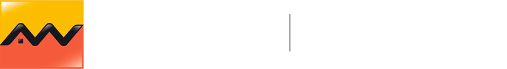    |                            `Attijariwafa Bank`                             |    31, Avenue Léopold Sédar Senghor – BP 32 003 Dakar Ponty    |                -                 |                          https://www.attijariwafabank.com/fr                          | (221) 33 889 98 98 -  (221) 33 823 48 57 |
|  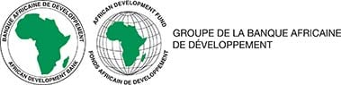  |                 `Banque Africaine de Développement (BAD)`                  |                               -                                |                -                 |                                https://www.afdb.org/fr                                |                    -                     |
|  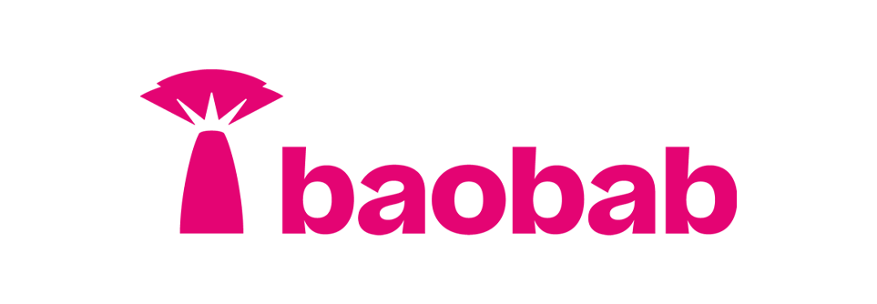   |                              `Banque Baobap`                               |                         Dakar, Senegal                         |                -                 |                                https://baobab.com/sn/                                 |                    -                     |
|  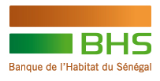  |                   `Banque de l'Habitat du Sénégal (BHS)`                   |      Boulevard Général De Gaulle / B.P 229 Dakar Sénégal       |                -                 |                                  https://www.bhs.sn/                                  |            +221 33 839 33 33             |
|  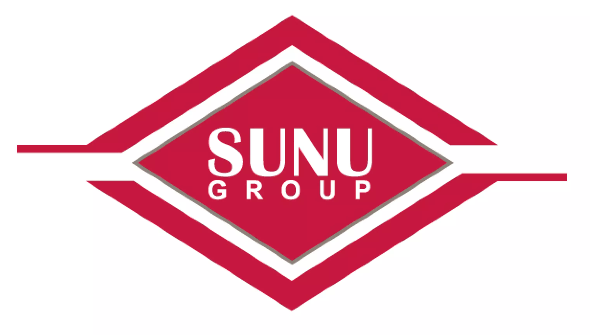  | `Banque Internationale pour le Commerce et l'Industrie au Sénégal (BICIS)` |                         Dakar Sénégal                          |       bicis@sunubicis.com        |                                https://sunubicis.com/                                 |       33 839 03 90 - 33 823 47 21        |
|  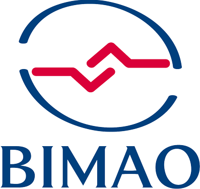  |     `Banque des Institutions Mutualistes d'Afrique de l'Ouest (BIMAO)`     |   Sacré-Coeur 3 Pyrotechnie VDN 15098 - CP 12524 Dakar-Fann    |        ebanking@bimao.sn         |                       https://ebanking.bimao.sn/PortailWeb/#!/                        |            +221 33 859 82 18             |
|  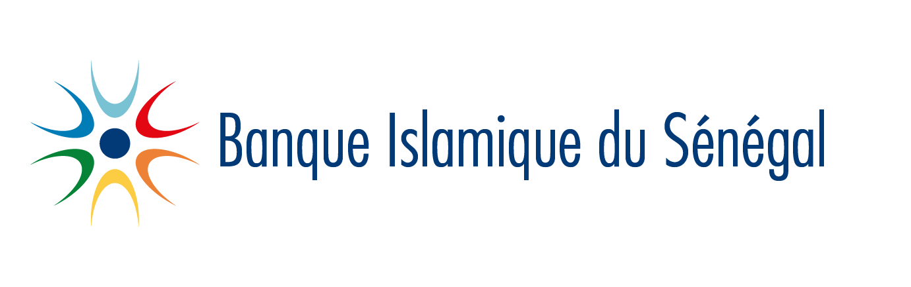  |                    `Banque Islamique du Sénégal (BIS)`                     | Almadies niveau rond-point, face route King FAH, Dakar-Sénégal |       contact@bis-bank.sn        |                                 https://bis-bank.com/                                 |  +221 33 849 62 62 - +221 33 822 49 48   |
|  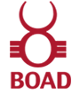  |               `Bank Ouest Africaine de Développement (BOAD)`               |                         BP 1992 Dakar                          |                -                 |                                 https://www.boad.org/                                 |       33.849.62.40 - 33.842.16.67        |
|  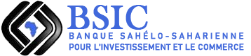  |  ` Banque Sahelo Saharienne pour l'Investissement et le Commerce (BSIC)`   |                               -                                |                -                 |                               https://bsicbank.com/eng/                               |       33.889.58.58 - 33.842.71.05        |
|  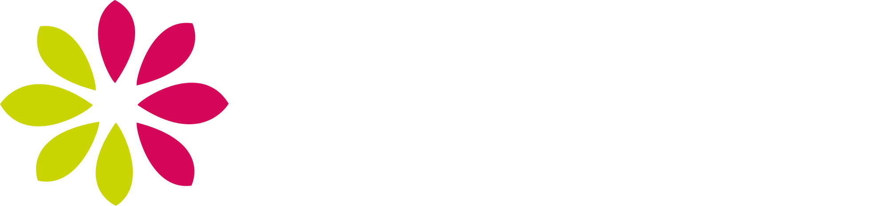  |           `Caisse Nationale de Crédit Agricole du Sénégal (CNCAS)`           |     Place de l’Indépendance, ancien immeuble d’Air Afrique     |                -                 |                           https://www.labanqueagricole.sn/                            |       33.839.36.36 - 33.821.26.06        |
|  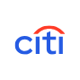  |                              `Citibank Sénégal`                              |                    MH99+J2C, Dakar, Senegal                    |    salimata.boye@citicorp.com    |                                 https://www.citi.com/                                 |       33 849 11 11 - 33 823 88 17        |
|        |             `Compagnie Bancaire de l'Afrique Occidentale (CBAO)`             |            place de l'indépendance - Dakar, Sénégal            |                -                 | https://www.attijariwafabank.com/en/international-subsidiaries/CBAO-S%C3%A9n%C3%A9gal |            +221 33 849 60 60             |
|  |                              `Ecobank Senegal`                               |                     Mermoz, Dakar, Sénégal                     |   ecobankenquiries@ecobank.com   |                      https://www.ecobank.com/sn/personal-banking                      |             +221 338 492 300             |
|  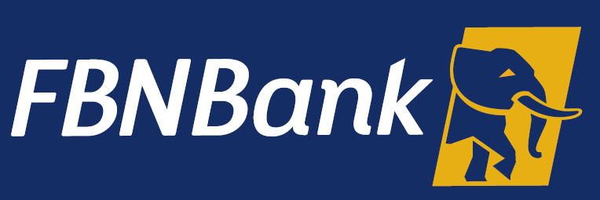   |                              `FBNBank Senegal`                               |       Dakar, Routes de Almadies Zone 15 Lot D, BP 11045        | serviceclient@fbnbanksenegal.com |                            https://www.fbnbanksenegal.com/                            |            +221 33 859 80 10             |
| 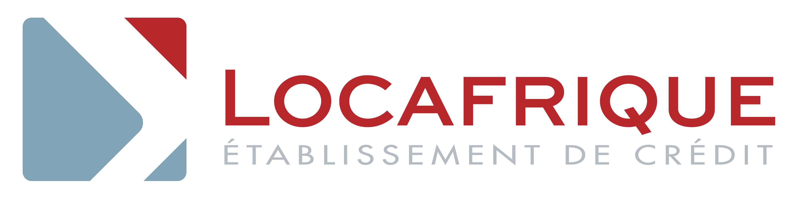  |                                 `LOCAFRIQUE`                                 |               Route de Ngor X Route des Almadies               |                -                 |                            https://www.locafrique-sf.com/                             |            +221 33 859 27 60             |
|     |                              `Orabank Senegal`                               |                         Dakar, Senegal                         |                -                 |                      https://www.orabank.net/fr/filiale/senegal                       |                    -                     |
|  |                `Société Général de Banque au Sénégal (SGBS)`                 |              Avenue Léopold Sédar Senghor à Dakar              |                -                 |                            https://societegenerale.sn/fr/                             | (221) 33 839 55 00 - (+221) 33 839 42 42 |
|  |                        `United Bank of Africa  (UBA)`                        |       Route des Almadies Zone 12 Lot D , Dakar, Sénégal        |     cfcsenegal@ubagroup.com      |                              https://www.ubasenegal.com/                              |      +221338595100 - +221338206010       |